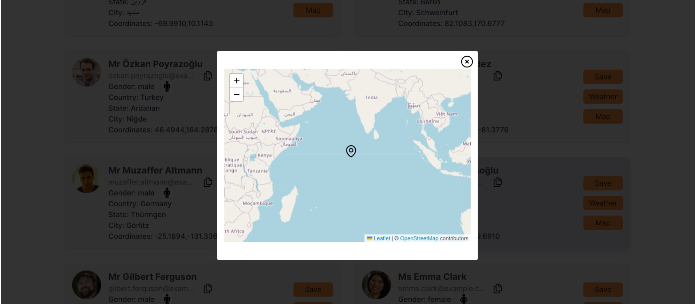
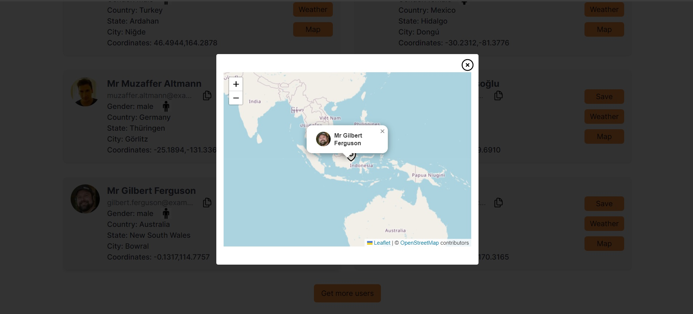

# Test Task

## Overview

The objective of this task is to evaluate the candidate's software design skills. The application created as part of this task is intended to view and save user information while also displaying the current weather based on the user's location.

## Specifications

The application should fulfill the following specifications:

1. **User Details**:
    - Name
    - Gender
    - Profile image
    - Location
    - Email

2. **Weather**:
    - Icon (Sunny, Cloudy, etc.)
    - Temperature (Current, Lowest, and Highest for the current date)

3. Each user card should have Save and Weather buttons:
    - Save: Saves details to the browser localStorage
    - Weather: Shows weather details for the user location in a modal
    - I also added a button to open map with user location

4. There should be a way to load more users.

### APIs

- **Users API**: [https://randomuser.me/api/](https://randomuser.me/api/)
- **Weather API**:
    - Example API Call: [https://api.open-meteo.com/v1/forecast?latitude=-19.7962&longitude=178.2180&current_weather=true&hourly=temperature_2m](https://api.open-meteo.com/v1/forecast?latitude=-19.7962&longitude=178.2180&current_weather=true&hourly=temperature_2m)
    - Documentation: [https://open-meteo.com/en/docs](https://open-meteo.com/en/docs)

## Requirements

- The application should be responsive and work seamlessly on desktop, tablet, and mobile devices.
- Styling implemented using  CSS framework (e.g., TailwindCSS, MUI, Ant, etc.). I used TailwindCSS.
- No authentication is required.
- Code should be production-ready, clean, and readable.
- The application should be fully functional and visually appealing.

### Bonus Points

- Update current temperature periodically (every 5 minutes).  (I did it using setInterval in useEffect)
     ``` tsx
    useEffect(() => {
        const fetchWeather = async () => {
            setError('');
            setIsLoading(true);
            try {
                const url = new URL('https://api.open-meteo.com/v1/forecast');
                url.searchParams.append('latitude', latitude);
                url.searchParams.append('longitude', longitude);
                url.searchParams.append('current_weather', 'true');
                url.searchParams.append('hourly', 'temperature_2m');
                const res = await fetch(url.toString());
                const data = await res.json();
                setWeather(data);
                setMinMax(getMinMaxWeather(data));
            } catch (e) {
                setError('Failed to fetch weather data');
            }
            setIsLoading(false);
        
        };
        fetchWeather();
        const intervalId = setInterval(fetchWeather, 5 * 60 * 1000);
        return () => clearInterval(intervalId);
    }, []);
    
    ```
- Show user location on a map. (I added user location on the map using marker)
  
- Show user profile image on the map. (I added user profile image on the map on click on marker)
  
- Show hourly weather. (I added hourly weather for the next 24 hours)

## Deliverables

- GitHub repository link.
- Link to the deployed application.

### Note

Please prioritize implementing the "happy flow" first before considering bonus points. Be reasonable about your time allocation.
